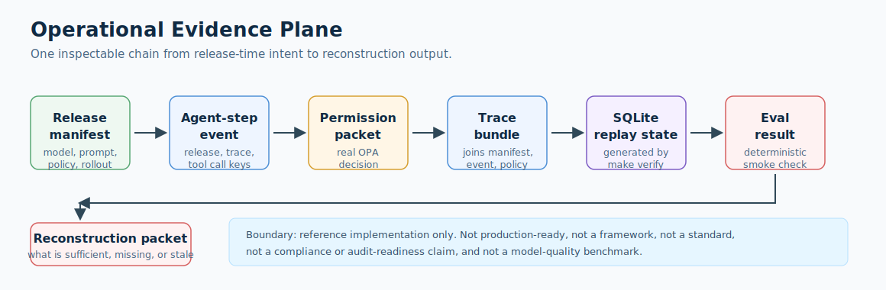

# Operational Evidence Plane

> Vendor-neutral reference implementation for agent runtime evidence:
> release manifests, runtime events, permissioned tool calls, traces,
> and replay state for agentic workflows.

[](https://github.com/agent-runtime-evidence/operational-evidence-plane/actions/workflows/verify.yml)
[](https://doi.org/10.5281/zenodo.20051036)

Operational Evidence Plane is a small, runnable reference implementation for making agent runtime behavior reconstructable after release. It binds release-time intent (model, prompt, tool schema, policy, workflow, rollout, eval, and data-state references) to runtime evidence (events, OPA-backed permission decisions, traces, replay state, eval results, and reconstruction packets).

A quick scan should make three things clear: the repository is code, not a concept note (`make verify` rebuilds replay state and checks joins, including counterfactual replay determinism); it is vendor-neutral, not a replacement for Bedrock, LangSmith, OPA, OTel, MCP, A2A, cloud release tools, Styra DAS, or Permit.io; and it is intentionally bounded to a deterministic code-review demo using mocked LLM behavior, SQLite state, and real OPA decisions.

Use it to inspect whether a runtime action can be joined back to a release manifest, verify policy decisions against trace and replay evidence, replay a stored decision under a substituted policy bundle, and package a minimal evidence chain that humans and CI can review without a vendor-specific control plane.

This repository is an open, vendor-neutral reference implementation. It extends patterns already visible in vendor-native agent versions, prompt registries, policy engines, and telemetry specs, but does not replace them and does not claim standardization or production readiness. The first demo target is a deterministic code-review agent using Python, SQLite, real OPA decisions, scenario-agnostic schemas, and mocked LLM behavior.

## Evidence Chain



The inspectable path is intentionally narrow: a release manifest names the shipped configuration, runtime events and OPA-backed permission packets record what happened, trace and replay state preserve the joins, eval/reconstruction outputs show what can and cannot be reconstructed, and the v0.3 counterfactual branch composes policy, cost, drift, cache, and identity metadata under a stored decision id.

## Counterfactual Replay

The v0.3 branch adds counterfactual replay primitives over the stored decision record. Given a stored `decision_id`, the policy replay path reconstructs the recorded OPA input context from SQLite, substitutes a different policy bundle, re-runs OPA deterministically, and emits an original-vs-counterfactual decision diff that validates against [`replay/counterfactual_replay.v0.schema.json`](replay/counterfactual_replay.v0.schema.json). Additional v0.3 paths record cost, reserve, five-surface drift, cache, and identity metadata under the same decision id.

```bash
oep replay pder_code_review_read_diff_0001 \
  --counterfactual \
  --policy-bundle permissions/policy/counterfactual/compound_reliability_step_bound.rego \
  --output-format json \
  --replay-timestamp-utc 2026-05-23T00:00:00Z
```

Policy, budget, reserve accounting, cache staleness, and config-surface
diffs are deterministic replays over recorded fields. Cross-provider model
substitution, cache substitution that implies a fresh model call, and
pre-session projection are labelled `replay_class: evaluative` and should
be read as counterfactual estimates. The three counterfactual demos, the
composed CLI paths, the per-surface validation gates, and the commercial
and academic precedents are documented in
[docs/counterfactual_replay.md](docs/counterfactual_replay.md).

Boundary: this is not a production-grade replay engine, not a compliance certification, not a substitute for vendor authorization-replay products, and does not constitute legal or regulatory adequacy by itself.

## Quickstart

Prerequisites:

- Python 3.11-3.14, matching the CI matrix
- OPA CLI 1.x, tested with 1.7.1.

OPA install examples:

```bash
# macOS, Homebrew
brew install opa

# Linux, x86_64
curl -L -o opa https://openpolicyagent.org/downloads/v1.7.1/opa_linux_amd64_static
chmod +x opa
sudo mv opa /usr/local/bin/opa
```

If OPA is available outside `PATH`, set `OEP_OPA_BIN_PATH=/path/to/opa`.
`OPA_PATH` is also accepted as a fallback override.
Set `OEP_OPA_EVAL_TIMEOUT_SECONDS` to tune the counterfactual OPA
subprocess timeout in seconds; the default is `30` and the minimum is
`0.001`. OPA stdin payloads are capped at 8 MiB; split larger replay
batches before evaluation.
Set `OEP_OPA_COMMAND_WRAPPER` to prepend a local containment command
to OPA invocations, for example `prlimit --as=100000000` in CI
environments that evaluate substituted policy bundles. The wrapper
executable is restricted to `docker`, `nice`, `prlimit`, or `sudo`.
The executable must resolve from `PATH` to a trusted system or local tool
directory such as `/usr/bin`, `/bin`, `/usr/sbin`, `/sbin`,
`/usr/local/bin`, or `/opt/homebrew/bin`.
Wrapper arguments are restricted to allow-listed options and strict
values for the selected wrapper; positional alternate binary targets are
rejected. Docker wrappers must use `docker run`, must include `--init`,
and may only use a constrained option set such as `--rm`,
`--network none`, `--user`, `--cpus`, `--memory`, `--pids-limit`,
`--read-only`, and read-only `-v` / `--volume` bind mounts in
`host_path:container_path:ro` form. When a
read-only bind mount contains the policy bundle path, OEP rewrites the
OPA `--data` argument to the corresponding container path.
Wrappers must keep the OPA child in the spawned process group
or forward termination signals so timeout cleanup can stop the full
evaluation tree.
Set `OEP_SQLITE_BATCH_VARIABLE_LIMIT` to raise the replay reader batch
limit above the default `900` on modern SQLite builds; values must stay
between `1` and `32766`.
The reference implementation invokes OPA through the CLI for each replay
batch. Higher-volume deployments can preserve the same deterministic
input/output contract while routing evaluation through a local OPA server
or a WASM runtime.

```bash
python3 -m venv .venv
. .venv/bin/activate
python -m pip install uv==0.11.10
uv sync --extra dev --locked
make verify
```

This compiles the packages, tests and evaluates the OPA policy, validates the counterfactual replay schema, regenerates `demo/state/code_review_agent.sqlite`, checks every cross-artifact join, validates the deterministic eval, checks the reconstruction packet, verifies the committed DTR JSONL projection, checks the MCP -> OEP permission packet projection, exercises the `oep replay` reader against generated replay state, and checks counterfactual replay determinism across generated SQLite, JSON/JSONL, and DTR outputs.
It also builds the root wheel/sdist, installs the wheel in a temporary virtual environment, and checks that the installed packages keep their typing markers.

Smoke tests run through pytest:

```bash
make test
```

Coverage runs the full verify chain plus pytest and fails below 95%:

```bash
make coverage
```

Linting, type checking, policy tests, and artifact maintenance:

```bash
make lint
make typecheck
make test-policy
make sync-resources
make build-check
make check-digests
make check-dtr-jsonl
make validate-counterfactual-replay
make check-replay-determinism
make update-digests
```

Installed package entry points:

```bash
oep-verify-manifest
oep-run-demo --state-path /tmp/oep-code-review.sqlite
oep-check-reconstruction
oep replay pder_code_review_read_diff_0001
OEP_REPLAY_MODE=counterfactual oep replay pder_code_review_read_diff_0001 --policy-bundle permissions/policy/counterfactual/compound_reliability_step_bound.rego
```

`oep replay <decision_id>` is a read-only reader over the local SQLite
replay store. It joins the recorded permission packet, agent-step event,
trace bundle, and release-manifest summary for a recorded decision id.
It does not make live model or vendor calls.

To inspect generated replay state:

```bash
sqlite3 demo/state/code_review_agent.sqlite \
  "select 'events', count(*) from events union all select 'permissions', count(*) from permissions union all select 'traces', count(*) from traces union all select 'evals', count(*) from evals union all select 'findings', count(*) from findings;"
```

To reset generated state:

```bash
make clean-state
```

To isolate generated state for a test run:

```bash
OEP_DEMO_STATE_PATH=/tmp/oep-code-review.sqlite make verify
python demo/scripts/run_code_review_demo.py --state-path /tmp/oep-code-review.sqlite
```

For the fastest read, open these in order:

1. [Architecture walkthrough](docs/architecture.md)
2. [Release manifest example](manifest/examples/code_review_agent_release.v0.json)
3. [Agent-step event example](events/examples/code_review_agent_step.v0.json)
4. [Tool permission packet](permissions/examples/code_review_tool_permission.v0.json)
5. [Operational trace bundle](traces/examples/code_review_agent_trace.v0.json)
6. [Deterministic eval result](traces/examples/code_review_agent_eval.v0.json)
7. [Reconstruction packet](playbooks/examples/code_review_reconstruction_packet.v0.json)

## Docs

- [Quickstart walkthrough](docs/quickstart_walkthrough.md)
- [Architecture walkthrough](docs/architecture.md)
- [Counterfactual replay guide](docs/counterfactual_replay.md)
- [Schema reference](docs/schema_reference.md)
- [Schema versioning policy](docs/schema_versioning.md)
- [Schema migration v0.3](docs/schema_migration_v0.3.md)
- [Record-keeping reference](docs/record_keeping_reference.md)
- [Landscape and prior art](docs/landscape.md)
- [Decision log](docs/decision_log.md)
- [Public claims guide](docs/public_claims.md)
- [Release checklist](docs/release_checklist.md)
- [Contributing guide](CONTRIBUTING.md)
- [Bedrock translation](translations/bedrock/README.md)
- [Decision Trace Reconstructor integration](integrations/decision-trace-reconstructor/README.md)
- [Model Context Protocol (MCP) adapter](integrations/mcp/README.md)
- [LangGraph adapter mapping](integrations/langgraph/README.md) — projection demo for LangGraph checkpoint events; production wrapper ships separately as the [`langgraph-oep`](https://github.com/agent-runtime-evidence/langgraph-oep) pip package (`pip install langgraph-oep`)

## Current Artifacts

The release manifest is the first inspectable release-time layer:

- [Release manifest schema](manifest/schema/release_manifest.v0.schema.json)
- [Code-review-agent release example](manifest/examples/code_review_agent_release.v0.json)
- [Deterministic model-behavior contract](demo/model/deterministic_mock_reviewer.md)
- [Code-review prompt contract](demo/prompts/code_review_agent.md)
- [Rollback and reconstruction rules](playbooks/rollback_reconstruction.md)

The manifest schema binds eight release-time field groups: model, prompt, tool schema, policy, workflow, rollout, eval, and data state.

The event profile is the first runtime join layer:

- [Agent-step event schema](events/schema/agent_step_event.v0.schema.json)
- [Code-review-agent event example](events/examples/code_review_agent_step.v0.json)
- [Denied tool-call event example](events/examples/code_review_agent_denied_step.v0.json)

The event schema carries `release_manifest_id`, `trace_id`, `span_id`, `checkpoint`, `entity_ref`, `action_type`, `tool_call_id`, `permission_packet_ref`, `replay_handle`, and evidence-loss notes.

The permission packet is the first OPA-backed runtime evidence layer:

- [Tool permission packet schema](permissions/schema/tool_permission_packet.v0.schema.json)
- [Code-review tool permission example](permissions/examples/code_review_tool_permission.v0.json)
- [Denied write permission example](permissions/examples/code_review_tool_permission_denied.v0.json)
- [OPA policy](permissions/policy/tool_permissions.rego)
- [Counterfactual replay output schema](replay/counterfactual_replay.v0.schema.json)
- [Compound reliability counterfactual policy](permissions/policy/counterfactual/compound_reliability_step_bound.rego)
- [Budget-per-run counterfactual policy](permissions/policy/counterfactual/budget_per_run_cap.rego)
- [Approval-per-step counterfactual policy](permissions/policy/counterfactual/approval_per_step_escalation.rego)
- [OPA input](permissions/policy/input/code_review_read_diff.json)
- [Denied OPA input](permissions/policy/input/code_review_write_diff.json)

The trace bundle is the first stitched reconstruction view:

- [Operational trace schema](traces/schema/operational_trace.v0.schema.json)
- [Code-review-agent trace bundle](traces/examples/code_review_agent_trace.v0.json)
- [Denied trace bundle](traces/examples/code_review_agent_denied_trace.v0.json)
- [Eval result schema](traces/schema/eval_result.v0.schema.json)
- [Code-review-agent eval result](traces/examples/code_review_agent_eval.v0.json)
- [Denied replay-readiness eval result](traces/examples/code_review_agent_denied_eval.v0.json)

The demo materializes local replay state:

- [Synthetic diff fixture](demo/fixtures/diff_synthetic_001.patch)
- [Replay-state recipe](demo/state/replay_state_recipe.md)
- [Deterministic demo runner](demo/src/oep_demo/runner.py)
- [Counterfactual demo runner](demo/src/oep_demo/counterfactual.py)
- [Run script](demo/scripts/run_code_review_demo.py)
- [Replay-state checker](demo/scripts/check_replay_state.py)
- [Counterfactual replay checker](replay/scripts/check_counterfactual_replay.py)

`make verify` regenerates `demo/state/code_review_agent.sqlite` from the committed artifacts, checks that the committed DTR JSONL projection is up to date, and runs the counterfactual replay determinism checks. SQLite files and generated counterfactual JSON/JSONL outputs under `demo/counterfactual/` are intentionally ignored; they are reproducible local state, not source.

The playbook packet is the first reconstruction output:

- [Reconstruction packet schema](playbooks/schema/reconstruction_packet.v0.schema.json)
- [Code-review reconstruction packet](playbooks/examples/code_review_reconstruction_packet.v0.json)
- [Denied blocked reconstruction packet](playbooks/examples/code_review_denied_reconstruction_packet.v0.json)
- [Scenario reconstruction checker](playbooks/scripts/check_reconstruction_packet.py)
- [Incident reconstruction case study](examples/incident_reconstruction/README.md)

The current inspectable chain is:

```text
release manifest -> agent-step event -> OPA-backed permission packet -> trace bundle -> SQLite replay state -> deterministic eval result -> reconstruction packet
```

The v0.3 counterfactual branch starts from the stored permission decision and replay state, substitutes policy, budget, model, cache, or config-surface inputs, and emits schema-validated attribution output. Deterministic surfaces replay over recorded fields; model and cache-fresh-call substitutions are labelled evaluative estimates. The primary eval is a deterministic smoke check over one synthetic fixture. The denied path demonstrates blocked replay readiness when OPA denies a tool call and no SQLite replay state is generated. Neither is a benchmark, model-quality claim, safety certification, or production monitoring result.

## Record-Keeping Reference

The replayable permission trace fields introduced in the v0.2 release line
and still current (credential lifetime, approval capture, policy and manifest
digests, resolved model identity, and the non-deterministic builtin cache)
and the education-only mapping of OEP record
fields to EU AI Act and NIST AI RMF record-keeping language are documented in
[docs/record_keeping_reference.md](docs/record_keeping_reference.md). The
mapping is reference material, not a compliance or audit claim.

## Replay CLI

```bash
oep replay <decision_id>
oep replay <decision_id> --counterfactual --policy-bundle <path-to-rego-bundle>
```

`oep replay` is a thin read-only reader over the local SQLite replay
store generated by `oep-run-demo` or `make verify`. It reconstructs the
recorded permission trace for a decision id (the `pder_*` packet
identifier) by joining the recorded permission packet, agent-step
event, trace bundle, and release-manifest summary.

The demo runner materializes SQLite state at a temporary path and publishes
the completed database with an atomic replace. Existing replay readers keep
their current file handle; new readers open the completed replacement.

- The CLI does not make live model or vendor API calls.
- It does not introduce new persistence; it only reads existing rows.
- Pass `--state-path` to read from an alternate SQLite path, or set
  `OEP_DEMO_STATE_PATH` before running the demo.
- Pass `--field <name>` to print a specific record field instead of the
  full JSON record.
- Pass `--counterfactual --policy-bundle <path>` to re-derive the
  decision under a substituted policy bundle. `OEP_REPLAY_MODE` accepts
  `read-only` (default) or `counterfactual`.
- Pass `--output-format json`, `jsonl`, or `human`. Read-only replay
  defaults to JSON; counterfactual replay defaults to human output.
- Pass `--replay-timestamp-utc <date-time>` in counterfactual mode when
  CLI JSON must be compared byte-for-byte.
- Pass `--strip-exclusions` in counterfactual JSON/JSONL mode to remove
  fields listed in `replay_metadata.determinism_exclusions` before output.

## MCP Adapter

The [`integrations/mcp/`](integrations/mcp/) directory ships an
illustrative adapter that translates one Model Context Protocol
(MCP) `tools/call` envelope into an OEP permission packet, including
the replayable permission trace fields added in v0.2. It is documentation and
mapping data with a standalone script — it does not call MCP servers
or vendor APIs.

The adapter is illustration, not a replacement for MCP, LangSmith,
Bedrock, OTel, A2A, or OPA. A LangGraph adapter ships alongside in
[`integrations/langgraph/`](integrations/langgraph/) as projection
mapping, and as the separate [`langgraph-oep`](https://github.com/agent-runtime-evidence/langgraph-oep)
pip package for runtime use. Other framework adapters (OpenAI
Assistants, Bedrock) remain post-core translation material.

The public anchors for the permission-evidence framing this adapter
exposes are the [Model Context Protocol authorization specification
(2025-03-26)](https://modelcontextprotocol.io/specification/2025-03-26/basic/authorization)
and the [NSA Cybersecurity Information sheet on MCP security design
considerations](https://www.nsa.gov/Portals/75/documents/Cybersecurity/CSI_MCP_SECURITY.pdf).
Both are cited as third-party public guidance, not as endorsements of
this repository. The integration-side reference list lives in
[`integrations/mcp/README.md`](integrations/mcp/README.md).

## Claim Boundaries

- reference implementation, not framework
- not a vendor replacement
- not ready for production use
- not a production-grade replay engine
- not a standardization proposal
- not a compliance certification
- not a substitute for vendor authorization-replay products
- does not create compliance, audit readiness, or legal sufficiency by itself
- does not constitute legal or regulatory adequacy by itself
- demonstrates one wiring pattern among several plausible ones
- designed for inspectability and education first

## Workspace Packages

The public Python distribution is the root package, `operational-evidence-plane`. The workspace directories below are source and development boundaries for the reference implementation; they are not independently published packages for this release line.

| Package | Intended scope |
|---|---|
| `manifest/` | Release-time binding records for model, prompt, tool schema, policy, workflow, rollout, eval, and data-state references. |
| `events/` | Scenario-agnostic runtime event profile and replay join keys. |
| `permissions/` | Tool-call permission decision records backed by real OPA decisions. |
| `traces/` | Trace and span examples that connect release manifests, events, permissions, evals, and replay handles. |
| `playbooks/` | Rollback and incident reconstruction rules that explain what evidence is sufficient, missing, or stale. |
| `demo/` | Deterministic code-review-agent scenario using mocked LLM behavior and local SQLite state. |

## Landscape and Prior Art

How this repository relates to Bedrock, Azure AI Projects, Vertex, LangSmith,
Styra DAS / Permit.io, OTel GenAI, MCP, and A2A, plus the SAL and ACP prior
art and the Bedrock translation, is collected in
[docs/landscape.md](docs/landscape.md).
## What This Is NOT

This is not an agent framework, model gateway, tracing backend, policy language, compliance product, legal-audit package, vendor replacement, production platform, production-grade replay engine, compliance certification, or substitute for vendor authorization-replay products. It does not constitute legal or regulatory adequacy by itself. It is also not a claim that adjacent vendor and open-source tools are absent. The safer claim is narrower: public artifacts mostly expose adjacent slices, and this repository demonstrates one inspectable way to stitch release-time and runtime evidence together.

## Reference Stack

- Language: Python.
- Demo model behavior: deterministic mocked LLM.
- Local state: SQLite.
- Policy decisions: real OPA.
- Demo scenario: code-review agent.
- Core schemas: scenario-agnostic first.
- Post-core translation: optional Bedrock-specific examples only after the vendor-neutral core exists.

## License

Apache-2.0
